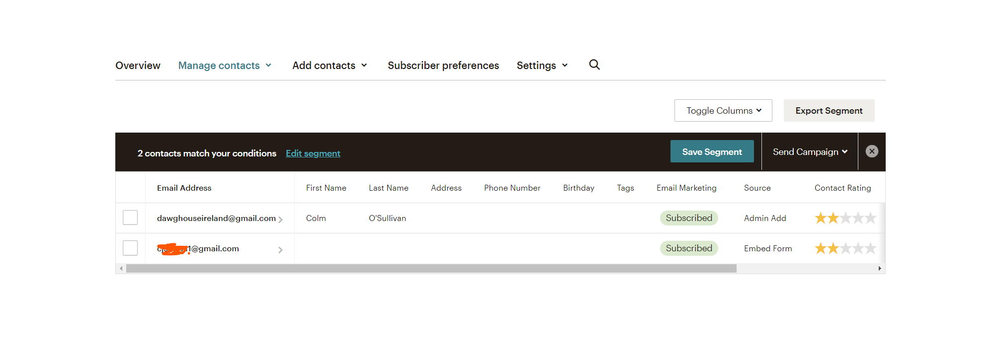

# DawgHouse
(Developer: Colm O'Sullivan)


[View live site](https://dawghouse.herokuapp.com/)

# Contents
* [**Project Goals**](<#project-goals>)
    *  [User Goals](#user-goals)
    *  [Site Owner Goals](#site-owner-goals)
* [**User Experience UX**](<#user-experience-ux>)
    *  [User Stories](<#user-stories>)
   1. [Structure](#structure)
        1. [Website pages](#website-pages)
        2. [Code Structure](#code-structure)
        3. [Physical database model](#physical-database-model)
        4. [Models](#models)
            1. [User Model](#user-model)
            2. [Profile Model](#profile-model)
            3. [Food_item Model](#food_item-model)
            4. [Review Model](#review-model)
            5. [Order Model](#order-model)
            6. [AboutMe Model](#aboutme-model)
    2. [Scope](#scope)
        1. [User Stories](#user-stories)
    3. [Skeleton](#skeleton)
        1. [Wireframes](#wireframes)
    4. [Surface](#surface)
        1. [Design Choices](#design-choices)
        2. [Colour](#colours)
        3. [Fonts](#fonts)
6. [Technologies Used](#technologies-used)
    1. [Languages](#languages)
    2. [Frameworks & Tools](#frameworks-&-tools)
7. [Features](#features)
8. [Testing](#validation)
    1. [HTML Validation](#HTML-validation)
    2. [CSS Validation](#CSS-validation)
    3. [JS Validation](#JS-validation)
    4. [Python Validation](#py-validation)
    5. [Accessibility](#accessibility)
    6. [Performance](#performance)
    7. [Device testing](#performing-tests-on-various-devices)
    8. [Browser compatibility](#browser-compatibility)
    9. [Testing user stories](#testing-user-stories)
9. [Bugs](#Bugs)
10. [Deployment](#deployment)
11. [Credits](#credits)
12. [Acknowledgements](#acknowledgements)

## Project Goals

The Primary goal of this website from the owners perspectice is as follows:

* To enable customers to purchase services listed on the sitek 
* To allow a user to navigate the website and view product details
* To allow a user to create an account & log in to an existing account
* To allow a user to create sign up to be one of their service providers
* To allow a user to view their account details
* To allow a user to submit contact form
* To allow a user to leave reviews on services
* To allow users to keep updated with a newsletter signup
* To be able to edit, add and remove services from the site
 

The Primary goal of this website from the users perspectice is as follows:

* To view service and service details
* To sign up to a newsletter
* To contact the site owner
* To be able top place a service order
* To add a Service to bag and purchase order
* To log into/out of an existing account


## User Experience (UX)

-   ### Target Audience
1. Dog Owners and lovers
2. Dog Walkers
3. Kennel Owners
4. Pet Sitters

## User Requirements and Expectations
- An easy navigation system with instant learning.
- Able to navigate the site quickly and easily.
- No broken links.
- Responsive and visually appealing on all devices.
- Ability to view services and complete purchases
- Ability to contact the Site owner

## SEO

Long tag and short tag keyword were searched for in regards to SEO using Google tools and other online resources.  These tags have been used in the main HTML head and throughout the project to name images and within main body text.

### Facebook Business Page

To assist with marketing the website, it has a link to its own social media page in the footer and that has a recipricol link to the site.

Facebook site can be viewed [here](https://www.facebook.com/Dawg-House-112813088340198)

Twitter site can be viewed [here](https://twitter.com/dawghouseire)


### Newsletter Signup

The site includes a signup form to a newsletter at footer so the business can keep in touch with it's site vistors.




## User stories

-   ### User

1. As a Site User I can easily understand the site layout so that I can easily navigate the site
2. As Site User I want About Me page so I can learn more about the company and it’s culture.   
3. As Site User I want Contact page so I can get answers on my queries.   
4. As Site User I want to be able to create User Profile.   
5. As Site User I want to be able to modify User Profile so I can easily update new details.  
6. As Site User I want to be able to delete my User Profile so I can easily remove my details from site.   
7. As Site User I want to be able to make a booking so I can set up arrangement for my pet to be looked after.   
8. As Site User I want to see what services are available so I can know that the service I need is available from the kennel.   
9. As Site User I want to see what rates are available so I can select boardings that fit my budget.   
10. As Site User I want to see some user reviews so I can see what other users experiences were like using the site.
11. As Site User I want to be able to leave reviews so I can let others know what my experience was like using the site and sitters.
12. As Site User I want to be able to easily access sites social medias so I can explore more on company.
13. As Site User I want to be able to easily access sites privacy statement so I can explore more on companies policies.
14. As Site User I want to be able to easily access sites Terms and conditions so I can explore more on companies policies.
15. As Site User to be able to sign up to be a service provider.
16. As Service Provider I want to be able to modify Profile so I can easily update new details .
17. As Service Provider I want to be able to delete my Profile so I can easily remove my details from site.
18. As Site User I want users to be sign up to a newsletter to capture user information.
19. As Site User I want to be able contact the business.
20. As Site User I want to be able to receive news and updates from the business.
21. As Site User I want to be able to navigate back to the services page after viewing service details
22. As Site User I want to be able to view services added to my shopping bag
23. As Site User I want to be able to checkout and purchase services
24. As Site User I want to be able to increase quantities and remove items from my shopping bag
25. As an unauthenticated user, I want to be able to log in to / sign out of an existing account
26. As an authenticated user, I want to be able to view and update my personal information in my profile
27. As an authenticated user, I want confirmation that I have signed out of my account
28. As a site owner, I want users to be able to navigate the website quickly and easily
29. As a site owner, I want users to be sign up to a newsletter to capture user information
30. As a site owner, I want users to be able to view the business social media.
31. As a staff user, I want to be able to update and edit services descriptions, details and prices
32. As a staff user, I want to be able to delete services
33.  As a staff user, I want to be able to add a services
34. As a staff user, I want to be able to manage services
35. As a Site user, I want to be shown messages that my actions have been successful and unsuccessful


-   ### Error Flow

1. As Site User, I user should be able to navigate back through the site structure in case of page not found without using the browser back button.
2. As a site owner, I want error pages that enables users to be able to return to valid areas of the site without using browser controls.    

## Scope

1. For first release, the scope is to provide users ability to register, login and oder services.
2. Future scope:
    1. Add dashboard for Service Providers to see bookings rather than wait for emails from site owner.
    2. Add Booking deletion and modificaitons
    3. Add options for users to add pets to their profiles
    4. Add option for Site user and stafff to add breeds on front end
    5. Add filters to booking services
    6. Validate address with eir code api
    7. Social media sign up
    8. Add Service Providers to services for filtering on location
    9. Add profile pictures to accounts
    10. Add additonal charges for breed sizes


#### Overview

## Structure
### Code Structure
The project is organised into a six applications, developed using the Django Framework.

App details as follows:
- home - holds landing page, about, privacy and termsn and conditions
- profiles - userprole and service provider
- services - services, reviews, breeds and sizes
- bag - holds checkout bag contents
- checkout - provides ability for user to checkout services
- contact - allows user to contact the site

To complement the apps there are
- project: Project level files - settings.py for project level settings and urls.py to route the website URLS
- templates: Containing the base.html, allauth(django authentication)
- templates (app level): each app has it's own templates directory for HTML to consider portability and re-use.
- urls (app level): each app has it's own url.py file to consider portability and re-use.
- static: Base css and Javascript files
- manage.py: This file is used to start the site and perform funcions during development
- README.md: Readme documentation
- Procfile: To run the application on Heroku
- Requirements.txt: Containing the project dependencies
Note: Environment variable values are not exposed in the source code, they are stored locally in env.py that is not checked in(and listed in .gitignore, and on Heroku in app settings


#### Physical database model

This model contains all fields stored in the database collections with their data type and mimics the structure of what is actually stored in the Elephant database 
<br>

#### Models
- The following models were created to represent the database model structure for the website

##### User Model
- The User model contains information about the user. It is part of the Django allauth library
- The model contains the following fields: username, password, first_name, last_name, is_staff, is_active, is_superuser, last_login, date_joined

##### User Profile Model
- The User Profile contains information about user such as contains further details such as email, fullname, phone number and address details for delivery purposes.
- It contains User as a foreign-key.
- The model contains the following fields:  email, Name, phone_number, address1, address2, county, eir_code, is_service_provider, acc_updated_on, acc_created_on

##### Service Provider Model
- The Service Provider contains information about service provider such as contains further details
- It contains Use Profile as a foreign-key.
- The model contains the following fields: service_type, total_occupancy, bio, bio, pet_allwd_in_house, has_fenced_garden, non_smoking, pet_allowed_in_house, owner_has_dog, owner_has_cat, one_pet_at_a_time, owner_has_children, price_per_service, created_on, updated_on, latitude, longitude

##### ContactModel
- The Contact Us model for the site users to be able to contact website owner with queries and is sent to the backend.
- It contains Service as a foreign-key.
- The model contains the following fields: email, body, creation_date, is_replied.

##### Service
- The The Service model for the site users to be able to view services on offer, details and cost on front end and to be FK to the Service order model. 
- The model contains the following fields: service_type, service_length, cost, sub_heading, detail_1, detail_2, desciptioin, slug

##### Breed
- The Breed model for the site owner to be able to update breeds and for site users to select their dog's breed.
- It contains Size as a foreign-key.
- The model contains the following fields: Breed, Size.

##### Size
- The Contact Us model for the site users to be able to contact website owner with queries and is sent to the backend.
- The model contains the following fields: name, additional_fee.

##### Comment Model
- The Review model is the model for users to leave a review on a Service.
- It contains Service as a foreign-key.
- When user submits review it is sent to the back end for the admin to approve before being displayed to the site.
- The model contains the following fields: service, email, comment, is_approved, created_on.

##### ServiceOrder
- The ServiceOrder model is for the site users to be able to purchases on website.
- It contains User and Service as a foreign-key.
- The model contains the following fields: user_id, service_provider_id, order_number, first_name, last_name, email, county, eircode, phone_number, created_on, order_total, original_bag, stripe_pid.

##### OrderLineItem
- The OrderLineItem model for the tracking of order line items into the service model and is primarly used on the backend to unpack bag items and update total cost.
- It contains Service, Order as a foreign-key.
- The model contains the following fields: service, order, breed, quantity,  lineitem_total

## Skeleton

### Wireframes


## Surface
### Design choices

The overall design of the website was to keep the site as clean and simple as possible and to choose colours that didn’t distract the user or take focus away from main purpose.

The site is straightforward to navigate, with a high contrasting navigation bar to enable ease of use for the user to find other main pages.

The background is neutral but bright, the images are not the focal point of the home page.


### Colours

Decided to use the default color classes from boostrap, they meet contrast standards and give site simple feel. Ple+us blue which main colour promotes trust and brand loyalty. White & Blue being main theme sed by many companies such as Dell, Faceboook and others.


After choosing a colour scheme I tested a number of palette options to make sure the it met accessibility standards. Idea was to keep it clean & simple with focus on readability.


### Typography

Aleo was choosen as the sites font as it is great for creating a simple and clean-looking web design. The font has nine styles from thin to black with a true italic to each. As a sans serif typeface, Aleo has high readability.

## Features

The site contains X pages and
1. Home page
2. Services
3. Sevices Details
4. Reviews
3. Log in
4. Log out
5. Register
6. Profile page
7. Shopping Cart
8. Contact
9. About
10. Admin


### Page 1 - Home page

#### Feature 1 - Header and navigation Bar, the header and navigation bar are shown across all pages.
The header shows the logo of the website, as well as a navigation bar with quick access to the main pages of the website. 
<br>

1. As a Site User I can easily understand the site layout so that I can easily 
28. As a site owner, I want users to be able to navigate the website quickly and easily


#### Feature 2 - Footer - has location, contact information and links to social media all of which open on new tab by default.
The footer features the business’ social media links, as well as links to the main pages the user would want to navigate. ALso holds contact information.
<br>

This feature covers the following user stories

12. As Site User I want to be able to easily access sites social medias so I can explore 
13. As Site User I want to be able to easily access sites privacy statement so I can explore more on companies policies.
14. As Site User I want to be able to easily access sites Terms and conditions so I can explore more on companies policies.
14. As Site User I want to be able to easily access sites Terms and conditions so I can explore more on companies policies.
18. As Site User I want users to be sign up to a newsletter to capture user information.
30. As a site owner, I want users to be able to view the business social media.
29. As a site owner, I want users to be sign up to a newsletter to capture user information


### Page 2 - Services page

#### Feature 3 Holds all the service items. It clearly displays name of food, description. 
<br>
This feature covers the following user stories:

1.	As a first time user, I want to be able to see menu and what I can order.
21.	As a site owner, I want users to be to view our full menu
22.	As a site owner, I want users to be able to view the food descriptions and prices

32. As a site owner, I want users to be able to see the menu
31. As a staff user, I want to be able to update and edit services descriptions, details and prices
32. As a staff user, I want to be able to delete services
33.  As a staff user, I want to be able to add a services
34. As a staff user, I want to be able to manage services


### Page 3 - Services Detailspage

#### Feature 4 -Display name of Service, description and prices. Page is set up for users to access reviews page.
<br>


This feature covers the following user stories:

9. As Site User I want to see what rates are available so I can select boardings that fit my budget.   
21. As Site User I want to be able to navigate back to the services page after viewing service details

### Page 4 - Order Now

#### Feature 5 Order Page Form - allows users to select items to order and fill out details to deliver to.
<br>
This feature covers the following user stories:

1.	As a first time user, I want to be able to see menu and what I can order.
4.	As a first time user, I want to be able to order food online.
21.	As a site owner, I want users to be to view our full menu
22.	As a site owner, I want users to be able to view the food descriptions and prices
32. As a site owner, I want users to be able to see the menu
35. As a logged in administrator, I want to be able to create, edit or remove content on the website.

#### Feature 6 Checkout Page - Confirms details of order & cost. User can proceed to checkout details page which takes payment.
<br>
<br>
This feature covers the following user stories:

7. As Site User I want to be able to make a booking so I can set up arrangement for my pet to be looked after.  
22. As Site User I want to be able to view services added to my shopping bag 
23. As Site User I want to be able to checkout and purchase services
24. As Site User I want to be able to increase quantities and remove items from my shopping bag

### Page 5 - About Me

#### Feature 7 - Share company ethos, content is updated from the backend.
<br>
This feature covers the following user stories:

12.	As a first time user, I want to know about the business and it’s ethos
24.	As a site owner, I want users to be able to see location of business
28.	As a site owner, I want users to be able to find out about our business ethos
29.	As a site owner, I want users to be able to navigate the site easily and quickly
35. As a logged in administrator, I want to be able to create, edit or remove content on the website.

### Page 6 - Sign In/ Log In and Update Profile
<br>

<br>

<br>

<br>

These features covers the following user stories:

8.	As a logged in user, I want to be able to be able to leave reviews
9.	As a first time user, I want to be able to delete my review
14. As a logged in user, I want to be able to to sign in to, or create an account
15. As a logged in user, I want to be able to log out of an account
25.	As a site owner, I want users to be able to leave a comment or review
26.	As a site owner, I want users to be able to view other comments and reviews
27.	As a site owner, I want users to be able to edit and delete comments or reviews
30. As a site owner, I want users to be able to sign in to, or create an account
31. As a site owner, I want users to be able to log out of their account
35. As a logged in administrator, I want to be able to create, edit or remove content on the website.

## Technologies Used

### Languages
- [HTML5](https://en.wikipedia.org/wiki/HTML5)
- [CSS3](https://en.wikipedia.org/wiki/CSS)
- [JS ES6](https://en.wikipedia.org/wiki/JavaScript)
- [Django](https://www.djangoproject.com/)
- [Python3](https://en.wikipedia.org/wiki/Python_(programming_language))
- [jQuery](https://jquery.com/)

#### Python Libraries

* asgiref==3.5.2
* cloudinary==1.30.0
* crispy-bootstrap5==0.7
* dj-database-url==1.0.0
* dj3-cloudinary-storage==0.0.6
* Django==3.2.16
* django-allauth==0.41.0
* django-crispy-forms==1.14.0
* oauthlib==3.2.2
* psycopg2==2.9.5
* python3-openid==3.2.0
* pytz==2022.6
* requests-oauthlib==1.3.1
* sqlparse==0.4.3
* stripe==5.0.0
* gunicorn==20.1.0


### Frameworks & Tools
- [Bootstrap 5.0](https://getbootstrap.com/docs/5.0) - for general site layout, grid, flex.
- [Bootstrap Icons 1.8](https://getbootstrap.com/) - for various icons in the site
- [ElephantSQL](https://api.elephantsql.com/) - this database was used in local development.
- [VSCode](https://code.visualstudio.com/) - my IDE of choice for this project.
- [Gitpod](https://gitpod.io/) - used occasionally for tutor support.
- [Github](https://github.com/) - used as the code repository.
- [Google Fonts](https://fonts.google.com/) - used for the main body font and some headings.
- [Balsamiq](https://balsamiq.com/) -  used to create the website wireframes.
- [Font Awesome](https://fontawesome.com/) - Font awesome was used to provide the relevant fonts/icons for the website social media icon links.
- [JQuery](https://jquery.com) - JQuery was used in some javascript files for DOM manipulation
- [CSS Validation Service](https://jigsaw.w3.org/css-validator/) - for validation of the css in the project.
- [HTML Markup Validation Service](https://validator.w3.org/) - for validation the HTML in the project.
- [Firefox dev tools](https://firefox-source-docs.mozilla.org/devtools-user/index.html) - troubleshooting and debugging of the project code.
- [Chrome Lighthouse](https://developers.google.com/web/tools/lighthouse) - for performance, accessibility, progressive web apps, SEO analysis of the project code.
- [JSHint](https://jshint.com/) - for javascript validation.
- [Lucid](https://www.lucidchart.com/pages/)- for the database schema diagram.
- [Facebook](https://www.facebook.com) - for social media marketing
- [Facebook](https://www.facebook.com) - for social media marketing
- [Stripe](https://stripe.com/gb) - For payments

## Validation

### HTML Validation
The HTML of the each page of the site was validated using [W3C Markup Validation Service](https://validator.w3.org/).  All pages returned a pass with 0 errors .

### CSS Validation
The [W3C CSS Validation Service](http://jigsaw.w3.org/css-validator/validator) was used to validate the CSS of the website. 

The custom CSS file for the site passed with 0 errors.

<details><summary>Custom CSS file</summary>

</details>


### JS Validation
The Javascript of the each page of the site was validated using [JSHint validation tool](https://jshint.com/).  All pages returned a pass with 0 errors.


### Py Validation
Pep8 validation tool is down [Python validation tool](http://pep8online.com/).  Flake was the tool used in it's place by issues warnings on migrations and settings were ignored.


#### Accessibility
The [WAVE WebAIM web accessibility evaluation tool](https://wave.webaim.org/ was used to ensure the website met high accessibility standards. All pages returned 1 error returned for google maps.
By defualt google maps doesn't provide labeling for it's api. To notify user to this I have added aria labeling to map from location details div in base html.


### Performance 
[Google Lighthouse](https://developers.google.com/web/tools/lighthouse/) was used to measure the performance and speed of the website -performance, accessibility, best practice and SEO with results below:

<details><summary>Home</summary>

</details>
<details><summary>Menu</summary>

</details>
<details><summary>About</summary>

</details>
<details><summary>Order</summary>

</details>
<details><summary>Log In</summary>

</details>
<details><summary>Sign Up</summary>

</details>


## Performing tests on various devices

The website was tested using Google Chrome Developer Tools Toggle Device Toolbar to simulate viewports of different devices.

The website was tested on the following devices:
- iPhone 7 (iphone screen)
- Oneplus Nord (Android screen)
- Asus (Laptop screen)

### Browser compatibility

- Testing has been carried out on the following browsers:
  - Googe Chrome Version 101.0.4951.41 (Official Build) (64-bit)
  - Firefox Browser 99.0.1 (64-bit)
  - Safari (64-bit)

### Testing user stories

1. As a first time user, I want to be able to see menu and what I can order.
21.	As a site owner, I want users to be to view our full menu
32. As a site owner, I want users to be able to see the menu


| **Feature** | **Action** | **Expected Result** | **Actual Result** |
|-------------|------------|---------------------|-------------------|
|  Menu page   | Select any menu option from main nav bar           |     Menu page is displayed with information                | Works as expected |
|     Menu page      |    Select nav item link on home page        |    Menu page is displayed with images and information by category                 | Works as expected |

<details><summary>Images</summary>

</details>
<hr>
2. As a first time user, I want to be able to navigate site easily.
29.	As a site owner, I want users to be able to navigate the site easily and quickly

| **Feature** | **Action** | **Expected Result** | **Actual Result** |
|-------------|------------|---------------------|-------------------|
|  Nav bar page   | Select any option from main nav bar           |     Menu page is displayed with information                | Works as expected |
|     Nav bar page       |    Select nav item links        |    Menu page is displayed with images and information by category                 | Works as expected |

<details><summary>Images</summary>

</details>
<hr>
3. As a first time user, I want clear information on where the restaurant is located.
24.	As a site owner, I want users to be able to see location of business

| **Feature** | **Action** | **Expected Result** | **Actual Result** |
|-------------|------------|---------------------|-------------------|
|  Footer   | Navigate to any page           |     See contact and location is displayed with information                | Works as expected |

<details><summary>Images</summary>

</details>
<hr>
4.	As a first time user, I want to be able to order food online

| **Feature** | **Action** | **Expected Result** | **Actual Result** |
|-------------|------------|---------------------|-------------------|
|  Order Now   | Navigate to order menu          |     Fill out form and select Item to order                | Works as expected |

<details><summary>Images</summary>

</details>
<hr>
5.	As a first time user, I want to view reviews so that I know what others thought of previous orders

| **Feature** | **Action** | **Expected Result** | **Actual Result** |
|-------------|------------|---------------------|-------------------|
|  Menu Item   | Navigate to menu items         |     See food items                | Works as expected |
|  Menu Item   | Navigate to menu item         |     See food item details                | Works as expected |
|  Menu Item   | Navigate to menu item review         |     See past reviews from other users                | Works as expected |

<details><summary>Images</summary>

</details>
<hr>
6.	As a first time user, I want to view About me page so that I know more about the company and it’s ethos

| **Feature** | **Action** | **Expected Result** | **Actual Result** |
|-------------|------------|---------------------|-------------------|
|  About  | Navigate to about page        |     See details on companies ethos                | Works as expected |

<details><summary>Images</summary>

</details>
<hr>
7.	As a first time user I want to be able to see other user’s comments and reviews
26.	As a site owner, I want users to be able to view other comments and reviews

| **Feature** | **Action** | **Expected Result** | **Actual Result** |
|-------------|------------|---------------------|-------------------|
|  Menu Item   | Navigate to Menu        |    See menu items              | Works as expected |
|  Menu Item   | Navigate to Food Item        |     See a reviews            | Works as expected |

<details><summary>Images</summary>

</details>
<hr>
8.	As a logged in user, I want to be able to be able to leave reviews
25.	As a site owner, I want users to be able to leave a comment or review

| **Feature** | **Action** | **Expected Result** | **Actual Result** |
|-------------|------------|---------------------|-------------------|
|  Menu Item | Login to site         |     After filling in details logged in                | Works as expected |
|  Menu Item   | Navigate to Menu        |    See menu items              | Works as expected |
|  Menu Item   | Navigate to Food Item        |     Leave a review option               | Works as expected |

<details><summary>Images</summary>

</details>
<hr>
9.	As a first time user, I want to be able to delete my review
27.	As a site owner, I want users to be able to edit and delete comments or reviews

| **Feature** | **Action** | **Expected Result** | **Actual Result** |
|-------------|------------|---------------------|-------------------|
|  Menu Item | Login to site         |     After filling in details logged in                | Works as expected |
|  Menu Item   | Navigate to Menu        |    See menu items              | Works as expected |
|  Menu Item   | Navigate to Food Item        |     Delete a review option               | Works as expected |

<details><summary>Images</summary>

</details>
<hr>
10.	As a first time user, I want to see confirmation page of my order so that I know how much it will cost and they have my correct details

| **Feature** | **Action** | **Expected Result** | **Actual Result** |
|-------------|------------|---------------------|-------------------|
|  Order Now   | Navigate to order menu          |     Fill out form and select Item to order                | Works as expected |

<details><summary>Images</summary>

</details>
<hr>
11.	As a first time user, I want to be able to know my order has been accepted

| **Feature** | **Action** | **Expected Result** | **Actual Result** |
|-------------|------------|---------------------|-------------------|
|  Order Now   | Navigate to order menu          |     Fill out form and select Item to order                | Works as expected |
|  Order Now   | Fill out form and submit         |     Taken to confirmation page                | Works as expected |

<details><summary>Images</summary>

</details>
<hr>
12.	As a first time user, I want to know about the business and it’s ethos

| **Feature** | **Action** | **Expected Result** | **Actual Result** |
|-------------|------------|---------------------|-------------------|
|  About  | Navigate to about page        |     See details on companies ethos                | Works as expected |

<details><summary>Images</summary>

</details>
<hr>
13. As a logged in user, I want to be able to update my profile

| **Feature** | **Action** | **Expected Result** | **Actual Result** |
|-------------|------------|---------------------|-------------------|
|  Sign In/ Log In and Update Profile  | Navigate to Profile tab       |     Click on Update Profile option                | Works as expected |
|  Sign In/ Log In and Update Profile  | Change detail on form and submit       |     Detail is updated              | Works as expected |
|  Sign In/ Log In and Update Profile  | No Action needed       |     Profile is updated              | Works as expected |

<details><summary>Images</summary>

</details>
<hr>

14. As a first in user, I want to be able to to sign in to or create an account
30. As a site owner, I want users to be able to sign in to, or create an account

| **Feature** | **Action** | **Expected Result** | **Actual Result** |
|-------------|------------|---------------------|-------------------|
|  Sign In/ Log In and Update Profile  | Navigate to Login/Sign Up        |     Click on Sign Up option                | Works as expected |
|  Sign In/ Log In and Update Profile  | Navigate to Login/Sign Up        |     Fill out form               | Works as expected |
|  Sign In/ Log In and Update Profile  | Filled out form       |     Auto Login               | Works as expected |

<details><summary>Images</summary>

</details>
<hr>

15. As a logged in user, I want to be able to log out of an account
31. As a site owner, I want users to be able to log out of their account

| **Feature** | **Action** | **Expected Result** | **Actual Result** |
|-------------|------------|---------------------|-------------------|
|  Sign In/ Log In and Update Profile | Navigate to logout option       |     After selecting option logout                | Works as expected |

<details><summary>Images</summary>

</details>
<hr>
16. As a first time user, I want to see confirmation page of my order so that I know how much it will cost and they have my correct details

| **Feature** | **Action** | **Expected Result** | **Actual Result** |
|-------------|------------|---------------------|-------------------|
|  Order Now   | Navigate to order menu          |     Fill out form and select Item to order                | Works as expected |
|  Order Now   | Fill out form and submit         |     Taken to confirmation page                | Works as expected |

<details><summary>Images</summary>

</details>
<hr>
18. As a logged in user, I want to be able to delete my profile

| **Feature** | **Action** | **Expected Result** | **Actual Result** |
|-------------|------------|---------------------|-------------------|
|  Sign In/ Log In and Update Profile  | Navigate to Profile tab       |     Click on Update Profile option                | Works as expected |
|  Sign In/ Log In and Update Profile  | Select Delete Profile       |    Asked for confirmation              | Works as expected |
|  Sign In/ Log In and Update Profile  | No Action needed       |     Profile is deleted              | Works as expected |

<details><summary>Images</summary>

</details>
<hr>
20.	As a site owner, I want to be able to Approve reviews
23.	As a site owner, I want to Manage reviews


| **Feature** | **Action** | **Expected Result** | **Actual Result** |
|-------------|------------|---------------------|-------------------|
|  Food Item page   | Sign in to admin panel          |     Land at admin panel menu                | Works as expected |
|  Food Item page   | Select Reviews panel         |     Taken to food item reviews              | Works as expected |
|  Food Item page   | Select Review and tick apporved option         |     Taken to review and apporved option now ticked              | Works as expected |
|  Food Item page   | Reviews Panel check         |     See food item review is approved              | Works as expected |

<details><summary>Images</summary>

</details>
<hr>
22.	As a site owner, I want users to be able to view the food descriptions and prices

| **Feature** | **Action** | **Expected Result** | **Actual Result** |
|-------------|------------|---------------------|-------------------|
|  Food Item page   | Sign in to admin panel          |     Land at admin panel menu                | Works as expected |
|  Food Item page   | Select Food Item panel         |     Taken to food item panel              | Works as expected |
|  Food Item page   | Select Food item and can update details        |    See food item is updated            | Works as expected |

<details><summary>Images</summary>

</details>
<hr>
23.	As a site owner, I want to Manage reviews
33. As a logged in administrator, I want to be able to review and approve or delete user reviews.

| **Feature** | **Action** | **Expected Result** | **Actual Result** |
|-------------|------------|---------------------|-------------------|
|  Food Item page   | Sign in to admin panel          |     Land at admin panel menu                | Works as expected |
|  Food Item page   | Select Reviews panel         |     Taken to food item reviews              | Works as expected |
|  Food Item page   | Select Review and select action delete review         |    See food item review is now deleted              | Works as expected |

<details><summary>Images</summary>

</details>
<hr>

27.	As a site owner, I want users to be able to edit and delete comments or reviews

| **Feature** | **Action** | **Expected Result** | **Actual Result** |
|-------------|------------|---------------------|-------------------|
|  Food Item page   | User edits review          |     Review goes for approval                | Works as expected |
|  Food Item page   | Sign in to admin panel          |     Land at admin panel menu                | Works as expected |
|  Food Item page   | Select Reviews panel         |     Taken to food item reviews              | Works as expected |
|  Food Item page   | Select Review and approve edited review         |    See food item approved             | Works as expected |

<details><summary>Images</summary>

</details>
<hr>

28.	As a site owner, I want users to be able to find out about our business ethos
35. As a logged in administrator, I want to be able to create, edit or remove content on the website.

| **Feature** | **Action** | **Expected Result** | **Actual Result** |
|-------------|------------|---------------------|-------------------|
|  Food Item page   | Sign in to admin panel          |     Land at admin panel menu                | Works as expected |
|  Food Item page   | Select About panel         |     Taken to About Me panel              | Works as expected |
|  Food Item page   | Select About me text and edit         |    See About section is updated            | Works as expected |

<details><summary>Images</summary>

</details>
<hr>
34. As a site owner, I want users to be able to view the business’ social media

| **Feature** | **Action** | **Expected Result** | **Actual Result** |
|-------------|------------|---------------------|-------------------|
|  Footer   | Navigate to any page           |     See social media links at end of page               | Works as expected |
|  Footer   | Click on any link          |     taken to appropriate site on new tab              | Works as expected |

<details><summary>Images</summary>

</details>
<hr>

## Bugs

| **Bug** | **Fix** |
| ----------- | ----------- |
| Installed incorrect django version | solved - pip3 install 'django<4' gunicorn |
| ERROR: Could not build wheels for backports.zoneinfo, which is required to install pyproject.toml-based projects | solved - create runtime.txt & vers 9(python-3.9.13) |
| Profile table - changed zip code from Integarfield to Charfield lead to value error | solved - delete table from database and run migrations. |
| Profile Table - email set null = True caused integratiy error | solved - remove null value |
| You can submit order with no items | solved - add custom jquery to check if checkformcontrol has checked item |
| Order confirmation page doesn't have logged in user in Sign Up/Login in nav bar | solved -change context 'user' to 'order_user' |
| Google maps location icon is causing waves error for capability due ot labeling, google maps does not off by default solution requires complicated javascript code | unresolved |
| No alert for unchecked items, redirects user to problem without prompt | unresolved |
| No alert for Logging in, only form of user alert not functioning | unresolved |
| No validation on the information filled out in user form | unresolved |

## Stripe
* Register for an account at stripe.com
* Go to Developers section once logged in
* Go to API keys section


* Note both the publishable and secret keys
* In your local environment(env.py) and Heroku, create environment variables STRIPE_PUBLIC_KEY and STRIPE_SECRET_KEY with the publishable and secret key values
os.environ.setdefault('STRIPE_PUBLIC_KEY', 'YOUR_VALUE_GOES_HERE')
os.environ.setdefault('STRIPE_SECRET_KEY', 'YOUR_VALUE_GOES_HERE')
* Back in the Developers section of your stripe account click on Webhooks


* Create a webhook with the url of your website /checkout/wh/, for example:
 https://dawghouse.herokuapp.com/checkout/wh/
* Select the payment_intent.payment_failed and payment_intent.succeeded as events to send
* Note the key created for this webhook
* In your local environment(env.py) and Heroku, create environment variable STRIPE_WH_SECRET with the secret values os.environ.setdefault('STRIPE_WH_SECRET', 'YOUR_VALUE_GOES_HERE')

## Google Email
* Create an email account at google.com, login, go to accounts settings in your gmail account and then click on Other Google Account Settings
* Go to accounts and import then click on other account settings
* Under signing into Google, turn on 2-step verification and follow the steps to enable
* Once verified click on app passwords, select Other as the app and give the password a name, for example Django
* Click create and a 16 digit password will be generated, copy this 16 digit password
* In the env.py file, create an environment variable called EMAIL_HOST_PASS with the 16 digit password
* In the env.py file, create an environment variable called EMAIL_HOST_USER with the email address of the gmail account
* Set and confirm the following values in the settings.py file to successfully send emails

# EMAIL SETTINGS

```
if 'DEVELOPMENT' in os.environ:
    EMAIL_BACKEND = 'django.core.mail.backends.console.EmailBackend'
    DEFAULT_FROM_EMAIL = 'dawghouseireland@example.com'
else:
    EMAIL_BACKEND = 'django.core.mail.backends.smtp.EmailBackend'
    EMAIL_USE_TLS = True
    EMAIL_HOST = 'smtp.gmail.com'
    EMAIL_PORT = 587
    EMAIL_HOST_USER = DEFAULT_FROM_EMAIL = os.environ.get("EMAIL_HOST_USER")
    EMAIL_HOST_PASSWORD = os.environ.get("EMAIL_HOST_PASS")
    DEFAULT_FROM_EMAIL = os.environ.get('EMAIL_HOST_USER')
```

* You will also need to set the variables EMAIL_HOST_PASS and EMAIL_HOST_USER in your production instance, for example Heroku

## Deployment

* This project was developed using a GitPod workspace. The code was committed to Git and pushed to GitHub using the terminal.

* Log in to [Heroku](https://id.heroku.com/login) or create an account
* On the main page click New and Create New App
* Note: new app name must be unique
* Next select your region, I chose Europe.
* Click Create App button
* Click in resources and select Heroku Postgres database
* Click Reveal Config Vars and add new config "SECRET_KEY"
* Click Reveal Config Vars and add new config "DISABLE_COLLECTSTATIC = 1"
* The next page is the project’s Deploy Tab. Click on the Settings Tab and scroll down to Config Vars
* Next, go to Buildpack section click Add Buildpack select python and Save Changes
* Scroll to the top of the page and choose the Deploy tab
* Select Github as the deployment method
* Confirm you want to connect to GitHub
* Search for the repository name and click the connect button
* Scroll to the bottom of the deploy page and select the preferred deployment type
* Click either Enable Automatic Deploys for automatic deployment when you push updates to Github

* As Heroku Student Pack no longer includes free access to the Postgres add-on I had to migrate Postgres databases from Heroku to keep ElephantSQL.
* Navigate to ElephantSQL.com and click “Get a managed database today”
* Select “Try now for FREE” in the TINY TURTLE database plan
* Select “Log in with GitHub” and authorize ElephantSQL with your selected GitHub account
* In the Create new team form

### Migrating databases
* Create a database
* Log in to ElephantSQL.com to access your dashboard
* Click “Create New Instance”
* Set up your plan
* Select “Select Region” EXAMPLE "EU-West-1 (Ireland)"
* Then click “Review”
* Check your details are correct and then click “Create instance”
* Return to the ElephantSQL dashboard and click on the database instance name for this project

### Migrating your data
* Navigate to the Postgres Migration Tool repo on github in a new browser tab
* Click the Gitpod button to open a new workspace
* Run the script " python3 reel2reel.py" command in the terminal
* In a different browser tab, go to your app in Heroku and select the Settings tab
* Click the “Reveal Config Vars” button
* Copy the value in the DATABASE_URL Config Var. It will start with postgres://
* Return to Gitpod and paste in the URL you just copied into the terminal where prompted to provide your DATABASE_URL and click enter
* In your original browser tab, get your ElephantSQL database URL. Again, it will start with postgres://
* Return to Gitpod and paste in the URL where prompted
* The data will now be downloaded from Heroku and uploaded to your ElephantSQL database
* To test that your database has been moved successfully, return to ElephantSQL and select BROWSER
* Click the “Table queries” button. If you see any options in the dropdown, your tables have been created
* Select a table name you recognise, and then click “Execute”
* You should see your data displayed relating to the table you selected

### Connecting ElephantSQL database to Heroku
* In the Heroku Dashboard for your project, open the Resources tab
* In the Resources tab, remove the existing Postgres add-on:
* Confirm by typing in the name of your Heroku app when prompted.
* Navigate to the Settings tab
* Reveal your existing Config Vars. The original DATABASE_URL should have been deleted when the add-on was removed.
* Add a new config var called DATABASE_URL and paste in the value for your ElephantSQL database, and click Add to save it.
* Check the Activity tab to confirm


### Final Deployment 

* Create a runtime.txt `python-3.8.14`
* Create a Procfile `web: gunicorn dawghouse.wsgi:application`
* When development is complete change the debug setting to: `DEBUG = False` in settings.py
* In Heroku settings, delete the config vars for `DISABLE_COLLECTSTATIC = 1`

### Forking This Project

* Open [GitHub](https://github.com/Colm1711/dawg_house)
* Find the 'Fork' button at the top right of the page
* Once you click the button the fork will be in your repository

### Cloning This Project / Local Deployment

* Clone this project by following the steps:

* Open [GitHub](https://github.com/Colm1711/dawg_house)
* You will be provided with three options to choose from, HTTPS, SSH or GitHub CLI, click the clipboard icon in order
to copy the URL
* Once you click the button the fork will be in your repository
* Open a new terminal
* Change the current working directory to the location that you want the cloned directory
* Type 'git clone' and paste the URL copied in step 3

```git clone https://github.comColm1711/dawg_house.git```

* Press 'Enter' and the project is cloned to your workspace
* Create an env.py file(do not commit this file to source control) in the root folder in your project, and add in the following code with the relevant key, value pairs, and ensure you enter the correct key values<br>

```
import os
os.environ["SECRET_KEY"]= 'TO BE ADDED BY USER'
os.environ["STRIPE_PUBLIC_KEY"]= 'TO BE ADDED BY USER'
os.environ["STRIPE_SECRET_KEY"]= 'TO BE ADDED BY USER'
os.environ["STRIPE_WH_SECRET"]= 'TO BE ADDED BY USER'
os.environ["AWS_ACCESS_KEY_ID"]= 'TO BE ADDED BY USER'
os.environ["AWS_SECRET_ACCESS_KEY"]= 'TO BE ADDED BY USER'
os.environ["EMAIL_HOST_USER"]= 'TO BE ADDED BY USER'
os.environ["EMAIL_HOST_PASS"]= 'TO BE ADDED BY USER'
os.environ["USE_AWS"]= 'TO BE ADDED BY USER'
os.environ["DATABASE_URL"]= 'TO BE ADDED BY USER'
os.environ["DEVELOPMENT"] ='True'
```


* Install the relevant packages as per the requirements.txt file.
* In the settings.py ensure the connection is set to either the Elephant database or the local sqllite database.
* Ensure to set debug to true in the settings.py file for local development.
* Add localhost/127.0.0.1 to the ALLOWED_HOSTS variable in settings.py.
* Run "python3 manage.py makemigrations --check --dry-run" to show migrations without actually writing any migrations
  - --verbosity will also show the complete migrations files that would be written.
* Run "python3 manage.py showmigrations" to check the status of the migrations.
* Run "python3 manage.py migrate --plan" Shows the migration operations that will be performed for the given migrate command.
* Run "python3 manage.py migrate" to migrate the database.
* Run "python3 manage.py createsuperuser" to create a super/admin user.
* Run manage.py loaddata db.json to load the fixtures data into the database.
* Start the application by running <code>python3 manage.py runserver</code>
* Open the application in a web browser, for example: http://127.0.0.1:8000/

## Credits

1. Django community - (https://django.fun/qa/328691/)
2. Slack Community - (https://stackoverflow.com/questions/)
3. CI Tutor Support
4. CI for content inspiration from lessons.
5. W3Schools - (https://www.w3schools.com/)
6. iStock - (https://www.istockphoto.com/search/2/image?phrase=poutine)
7. Boostrap community - (https://getbootstrap.com/docs/5.0/)


### Media

Media from the following artists was used throughout the site.

- [Pexels](https://www.pexels.com/)
- [iStock](https://www.istockphoto.com/)
- Code for comments adapted from Code Institute Django blog
- Code for checkout and bag adapted from Code Institute Boutique Ado

### Acknowledgements: 

- To my girlfriend Ewelina Wolska,my brother Fintan and family for testing, support, feedback, permissions for content and images on this project. 
- To my mentor Mo Shami for his invaluable guidance and direction.
- To the Code Institute slack community of students.
- To the Code Institute Tutors