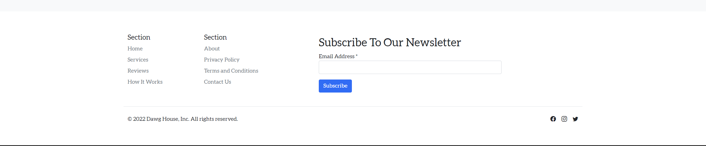
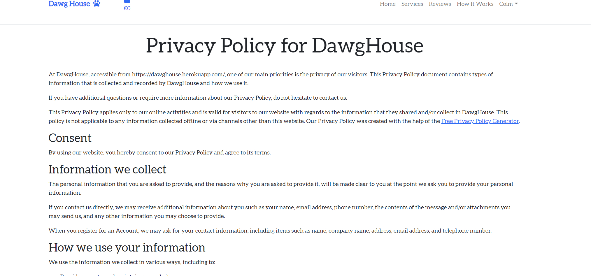
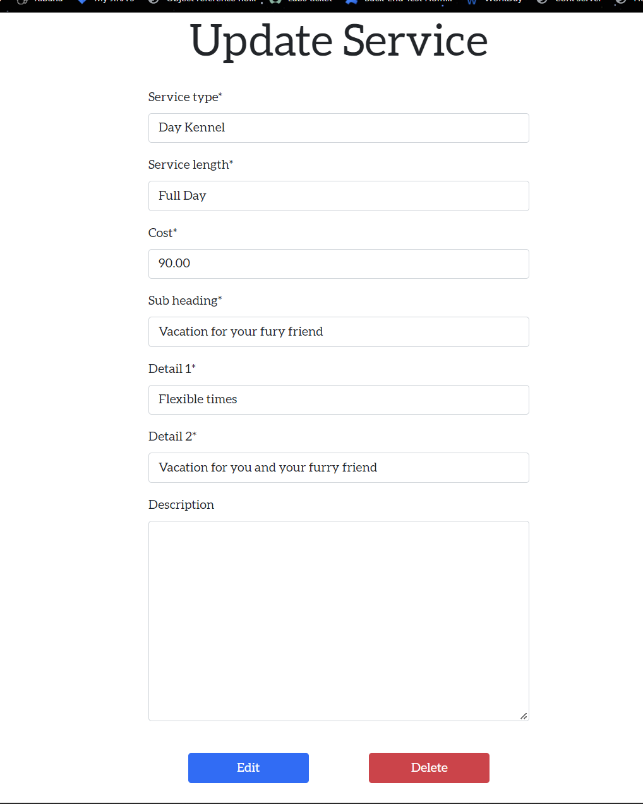

# DawgHouse
(Developer: Colm O'Sullivan)

## Overview

Dawghouse is an e-commerce site aimed at offering services to dog owners looking to have their furry friend cared for when they are busy or away on vacation based in Ireland. It's ultimate aim is to take payments for services and to then link up cusomters with the service providers that register with them.


[View live site](https://dawghouse.herokuapp.com/)

# Contents
* [**Project Goals**](<#project-goals>)
    *  [User Goals](#user-goals)
* [**SEO**](<#seo>)
* [**User Experience UX**](<#user-experience-ux>)
    *  [User Stories](<#user-stories>)
   1. [Structure](#structure)
        1. [Website pages](#website-pages)
        2. [Code Structure](#code-structure)
        3. [Physical database model](#physical-database-model)
        4. [Models](#models)
    2. [Scope](#scope)
        1. [User Stories](#user-stories)
    3. [Skeleton](#skeleton)
        1. [Wireframes](#wireframes)
    4. [Surface](#surface)
        1. [Design Choices](#design-choices)
        2. [Colour](#colours)
        3. [Fonts](#fonts)
6. [Technologies Used](#technologies-used)
    1. [Languages](#languages)
    2. [Frameworks & Tools](#frameworks-&-tools)
7. [Features](#features)
8. [Testing](#validation)
    1. [HTML Validation](#HTML-validation)
    2. [CSS Validation](#CSS-validation)
    3. [JS Validation](#JS-validation)
    4. [Python Validation](#py-validation)
    5. [Accessibility](#accessibility)
    6. [Performance](#performance)
    7. [Device testing](#performing-tests-on-various-devices)
    8. [Browser compatibility](#browser-compatibility)
    9. [Testing user stories](#testing-user-stories)
9. [Bugs](#Bugs)
10. [Deployment](#deployment)
11. [Credits](#credits)
12. [Acknowledgements](#acknowledgements)

## Project Goals

Agile Methodology was used in this project implementing the SCRUM project management methodology borrowing MoSCow principles as this was a small team, looking to remove all obstacles to getting the work done. This was done as most work was done in sprints to allow for rapid development.

Please find the link to the Kanban board used [here](https://github.com/users/Colm1711/projects/7/views/1)

# User Goals

The Primary goal of this website from the owners perspective is as follows:

* To enable customers to purchase services listed on the sitek 
* To allow a user to navigate the website and view product details
* To allow a user to create an account & log in to an existing account
* To allow a user to create sign up to be one of their service providers
* To allow a user to view their account details
* To allow a user to submit contact form
* To allow a user to leave reviews on services
* To allow users to keep updated with a newsletter signup
* To be able to edit, add and remove services from the site
 

The Primary goal of this website from the users perspective is as follows:

* To view service and service details
* To sign up to a newsletter
* To contact the site owner
* To be able top place a service order
* To add a Service to bag and purchase order
* To log into/out of an existing account


## SEO

Long tag and short tag keyword were searched for in regards to SEO using Google tools and other online resources.  These tags have been used in the main HTML head and throughout the project. This was done via "Brain Dumps" on Google search to see what the hoghest return rate words and tested on [wordtracker](https://www.wordtracker.com/)

Words used that returned highest hit rate:

1. Dogs
2. Dog Sitters
3. Dog Minder
4. Pet sitting
4. Dog walker near me

These helped build the tags used.

### Facebook Business Page

To assist with marketing the website, it has a link to its own social media page in the footer and that has a recipricol link to the site.

Facebook site can be viewed [here](https://www.facebook.com/Dawg-House-112813088340198)

Twitter site can be viewed [here](https://twitter.com/dawghouseire)


### Newsletter Signup

The site includes a signup form to a newsletter at footer so the business can keep in touch with it's site vistors.


## User Experience (UX)

-   ### Target Audience
1. Dog Owners and lovers
2. Dog Walkers
3. Kennel Owners
4. Pet Sitters

### User Requirements and Expectations
- An easy navigation system with instant learning.
- Able to navigate the site quickly and easily.
- No broken links.
- Responsive and visually appealing on all devices.
- Ability to view services and complete purchases
- Ability to contact the Site owner

## User stories

-   ### User

1. As a Site User I can easily understand the site layout so that I can easily navigate the site
2. As Site User I want About Me page so I can learn more about the company and it’s culture.   
3. As Site User I want Contact page so I can get answers on my queries.   
4. As Site User I want to be able to create User Profile.   
5. As Site User I want to be able to modify User Profile so I can easily update new details.  
6. As Site User I want to be able to delete my User Profile so I can easily remove my details from site.   
7. As Site User I want to be able to make a booking so I can set up arrangement for my pet to be looked after.   
8. As Site User I want to see what services are available so I can know that the service I need is available.   
9. As Site User I want to see what rates are available so I can select boardings that fit my budget.   
10. As Site User I want to see some user reviews so I can see what other users experiences were like using the site.
11. As Site User I want to be able to leave reviews so I can let others know what my experience was like using the site and sitters.
12. As Site User I want to be able to easily access sites social medias so I can explore more on company.
13. As Site User I want to be able to easily access sites privacy statement so I can explore more on companies policies.
14. As Site User I want to be able to easily access sites Terms and conditions so I can explore more on companies policies.
15. As Site User to be able to sign up to be a service provider.
16. As Service Provider I want to be able to modify Profile so I can easily update new details .
17. As Service Provider I want to be able to delete my Profile so I can easily remove my details from site.
18. As Site User I want users to be sign up to a newsletter to capture user information.
19. As Site User I want to be able contact the business.
20. As Site User I want to be able to receive news and updates from the business.
21. As Site User I want to be able to navigate back to the services page after viewing service details
22. As Site User I want to be able to view services added to my shopping bag
23. As Site User I want to be able to checkout and purchase services
24. As Site User I want to be able to increase quantities and remove items from my shopping bag
25. As an unauthenticated user, I want to be able to log in to / sign out of an existing account
26. As an authenticated user, I want to be able to view and update my personal information in my profile
27. As an authenticated user, I want confirmation that I have signed out of my account
28. As a site owner, I want users to be able to navigate the website quickly and easily
29. As a site owner, I want users to be sign up to a newsletter to capture user information
30. As a site owner, I want users to be able to view the business social media.
31. As a staff user, I want to be able to update and edit services descriptions, details and prices
32. As a staff user, I want to be able to delete services
33.  As a staff user, I want to be able to add a services
34. As a staff user, I want to be able to manage services
35. As a Site user, I want to be shown messages that my actions have been successful and unsuccessful


-   ### Error Flow

1. As Site User, I user should be able to navigate back through the site structure in case of page not found without using the browser back button.
2. As a site owner, I want error pages that enables users to be able to return to valid areas of the site without using browser controls.    

## Scope

1. For first release, the scope is to provide users ability to register, login and oder services.
2. Future scope:
    1. Add dashboard for Service Providers to see bookings rather than wait for emails from site owner.
    2. Add Booking deletion and modificaitons
    3. Add options for users to add pets to their profiles
    4. Add option for Site user and stafff to add breeds on front end
    5. Add filters to booking services
    6. Validate address with eir code api
    7. Social media sign up
    8. Add Service Providers to services for filtering on location
    9. Add profile pictures to accounts
    10. Add additonal charges for breed sizes


## Structure
### Code Structure
The project is organised into a six applications, developed using the Django Framework.

App details as follows:
- home - holds landing page, about, privacy and termsn and conditions
- profiles - userprole and service provider
- services - services, reviews, breeds and sizes
- bag - holds checkout bag contents
- checkout - provides ability for user to checkout services
- contact - allows user to contact the site

To complement the apps there are
- project: Project level files - settings.py for project level settings and urls.py to route the website URLS
- templates: Containing the base.html, allauth(django authentication)
- templates (app level): each app has it's own templates directory for HTML to consider portability and re-use.
- urls (app level): each app has it's own url.py file to consider portability and re-use.
- static: Base css and Javascript files
- manage.py: This file is used to start the site and perform funcions during development
- README.md: Readme documentation
- Procfile: To run the application on Heroku
- Requirements.txt: Containing the project dependencies
Note: Environment variable values are not exposed in the source code, they are stored locally in env.py that is not checked in(and listed in .gitignore, and on Heroku in app settings


#### Physical database model

This model contains all fields stored in the database collections with their data type and mimics the structure of what is actually stored in the Elephant database 
<br>

#### Models
- The following models were created to represent the database model structure for the website

##### User Model
- The User model contains information about the user. It is part of the Django allauth library
- The model contains the following fields: username, password, first_name, last_name, is_staff, is_active, is_superuser, last_login, date_joined

##### User Profile Model
- The User Profile contains information about user such as contains further details such as email, fullname, phone number and address details for delivery purposes.
- It contains User as a foreign-key.
- The model contains the following fields:  email, Name, phone_number, address1, address2, county, eir_code, is_service_provider, acc_updated_on, acc_created_on

##### Service Provider Model
- The Service Provider contains information about service provider such as contains further details
- It contains Use Profile as a foreign-key.
- The model contains the following fields: service_type, total_occupancy, bio, bio, pet_allwd_in_house, has_fenced_garden, non_smoking, pet_allowed_in_house, owner_has_dog, owner_has_cat, one_pet_at_a_time, owner_has_children, price_per_service, created_on, updated_on, latitude, longitude

##### ContactModel
- The Contact Us model for the site users to be able to contact website owner with queries and is sent to the backend.
- It contains Service as a foreign-key.
- The model contains the following fields: email, body, creation_date, is_replied.

##### Service
- The The Service model for the site users to be able to view services on offer, details and cost on front end and to be FK to the Service order model. 
- The model contains the following fields: service_type, service_length, cost, sub_heading, detail_1, detail_2, desciptioin, slug

##### Breed
- The Breed model for the site owner to be able to update breeds and for site users to select their dog's breed.
- It contains Size as a foreign-key.
- The model contains the following fields: Breed, Size.

##### Size
- The Contact Us model for the site users to be able to contact website owner with queries and is sent to the backend.
- The model contains the following fields: name, additional_fee.

##### Comment Model
- The Review model is the model for users to leave a review on a Service.
- It contains Service as a foreign-key.
- When user submits review it is sent to the back end for the admin to approve before being displayed to the site.
- The model contains the following fields: service, email, comment, is_approved, created_on.

##### ServiceOrder
- The ServiceOrder model is for the site users to be able to purchases on website.
- It contains User and Service as a foreign-key.
- The model contains the following fields: user_id, service_provider_id, order_number, first_name, last_name, email, county, eircode, phone_number, created_on, order_total, original_bag, stripe_pid.

##### OrderLineItem
- The OrderLineItem model for the tracking of order line items into the service model and is primarly used on the backend to unpack bag items and update total cost.
- It contains Service, Order as a foreign-key.
- The model contains the following fields: service, order, breed, quantity,  lineitem_total

## Skeleton

### Wireframes

 <details>
  <summary>Wireframes</summary>

  
  
  
  
  
  
  

  </details>

## Surface
### Design choices

The overall design of the website was to keep the site as clean and simple as possible and to choose colours that didn’t distract the user or take focus away from main purpose.

The site is straightforward to navigate, with a high contrasting navigation bar to enable ease of use for the user to find other main pages.

The background is neutral but bright, the images are not the focal point of the home page.


### Colours

Decided to use the default color classes from boostrap, they meet contrast standards and give site simple feel. Ple+us blue which main colour promotes trust and brand loyalty. White & Blue being main theme sed by many companies such as Dell, Faceboook and others. [reference](https://www.impactplus.com/blog/the-psychology-of-design-the-color-blue-in-marketing-branding#:~:text=%E2%80%9CBlue%20is%20known%20for%20its,professionalism%2C%20authority%2C%20and%20trust.)


After choosing a colour scheme I tested a number of palette options to make sure the it met accessibility standards. Idea was to keep it clean & simple with focus on readability.


### Typography

Aleo was choosen as the sites font as it is great for creating a simple and clean-looking web design. The font has nine styles from thin to black with a true italic to each. As a sans serif typeface, Aleo has high readability.

## Features

The site contains 18 pages and 23 Features
1. Home page
    - Navbar 
    - Footer
2. About
3. Terms and conditions
4. Privacy Policy
5. Services
6. Staff Add services
7. Staff Edit services
    - Delete Services
8. Sevices Details
9. Reviews
    - Delete Review
10. Log in
11. Log out
12. Sign Up
13. Profile page
    - Delete Profile
14. Add Service Provider page
15. Update Service Provider page
    - Delete Service Provider Page
16. Shopping Cart
17. Checkout Form
18. Checkout Success

### Page 1 - Home page

<br>

#### Feature 1 - Header and navigation Bar, the header and navigation bar are shown across all pages.

This feature covers the following user stories:

1. As a Site User I can easily understand the site layout so that I can easily 
28. As a site owner, I want users to be able to navigate the website quickly and easily


#### Feature 2 - Footer - has contact information and links to social media all of which open on new tab by default.

<br>

The footer features the business’ social media links, as well as links to the main pages the user would want to navigate. ALso holds contact information.

This feature covers the following user stories:

12. As Site User I want to be able to easily access sites social medias so I can explore 
18. As Site User I want users to be sign up to a newsletter to capture user information.
30. As a site owner, I want users to be able to view the business social media.
29. As a site owner, I want users to be sign up to a newsletter to capture user information

### Page 2 - About

<br>

#### Feature 3 - Share company ethos.

This feature covers the following user stories:

2. As Site User I want About Me page so I can learn more about the company and it’s culture. 


### Page 3 - Terms and conditions

<br>

#### Feature 4 - Share company Terms and conditions

This feature covers the following user stories:

14. As Site User I want to be able to easily access sites Terms and conditions so I can explore more on companies policies.

### Page 4 Privacy Policy

<br>

### Feature 5 - Share companie privacy policies

This feature covers the following user stories:

13. As Site User I want to be able to easily access sites privacy statement so I can explore more on companies policies.

### Page 5 Services

<br>

### Feature 6 - Display name of Service, description and prices. Page is set up for users to access reviews page.

This feature covers the following user stories:

8. As Site User I want to see what services are available so I can know that the service I need is available.  


### Page 6 Staff Add services

<br>

### Feature 7 - Give Admin Users the ability to add services

This feature covers the following user stories:


8. As Site User I want to see what services are available so I can know that the service I need is available. 
33.  As a staff user, I want to be able to add a services
35. As a Site user, I want to be shown messages that my actions have been successful and unsuccessful

### Page 7 Staff Edit services

<br>

#### Feature 8 Update services

This feature covers the following user stories:

34. As a staff user, I want to be able to manage services
35. As a Site user, I want to be shown messages that my actions have been successful and unsuccessful

32. As a staff user, I want to be able to delete services

#### Feature 9 Delete Services from Site

This feature covers the following user stories:

31. As a staff user, I want to be able to update and edit services descriptions, details and prices
35. As a Site user, I want to be shown messages that my actions have been successful and unsuccessful

### Page 8 Sevices Details

#### Feature 10 Show Sevice Details to USer

<br>

This feature covers the following user stories:

9. As Site User I want to see what rates are available so I can select boardings that fit my budget.   
21. As Site User I want to be able to navigate back to the services page after viewing service details
35. As a Site user, I want to be shown messages that my actions have been successful and unsuccessful

### Page 9 Reviews

<br>
<br>
<br>

#### Feature 11 Show Reviews Review

#### Feature 12 Delete Reviews Review

This feature covers the following user stories:

10. As Site User I want to see some user reviews so I can see what other users experiences were like using the site.
11. As Site User I want to be able to leave reviews so I can let others know 
35. As a Site user, I want to be shown messages that my actions have been successful and unsuccessful

### Page 10 Log in

<br>

#### Feature 13 Log In

This feature covers the following user stories:

25. As an authenticated user, I want to be able to log in to / sign out of an existing account
35. As a Site user, I want to be shown messages that my actions have been successful and unsuccessful


### Page 11 Sign Up 

<br>

#### Feature 14 Register Users

This feature covers the following user stories:

4. As Site User I want to be able to create User Profile. 
35. As a Site user, I want to be shown messages that my actions have been successful and unsuccessful 

### Page 12 Log Out

<br>

#### Feature 15 Allow Registered Users to sign out

This feature covers the following user stories:

25. As an authenticated user, I want to be able to log in to / sign out of an existing account
27. As an authenticated user, I want confirmation that I have signed out of my account
35. As a Site user, I want to be shown messages that my actions have been successful and unsuccessful

### Page 13 Profile page

<br>

#### Feature 16 Allow Registered Users to view Profile details saved with site

This feature covers the following user stories:

5. As Site User I want to be able to modify User Profile so I can easily update new details.
26. As an authenticated user, I want to be able to view and update my personal information in my profile
35. As a Site user, I want to be shown messages that my actions have been successful and unsuccessful


#### Feature 17 Allow Registered Users to delete their details

This feature covers the following user stories:

6. As Site User I want to be able to delete my User Profile so I can easily remove my details from site.
35. As a Site user, I want to be shown messages that my actions have been successful and unsuccessful

### Page 14 Sign Up Service Provider page

<br>

#### Feature 18 Allow users to sign up to become Service Providers on first login they are redirect to fill out details via adaptor

This feature covers the following user stories:

15. As Site User to be able to sign up to be a service provider.
35. As a Site user, I want to be shown messages that my actions have been successful and unsuccessful

### Page 15 Update Service Provider page

<br>

#### Feature 19 Allow Service providers to view Profile details saved with site

This feature covers the following user stories:
 
16. As Service Provider I want to be able to modify Profile so I can easily update new details.
35. As a Site user, I want to be shown messages that my actions have been successful and unsuccessful

#### Feature 20 Allow Service providers Page to delete their details

This feature covers the following user stories:

17. As Service Provider I want to be able to delete my Profile so I can easily remove my details from site.
35. As a Site user, I want to be shown messages that my actions have been successful and unsuccessful

### Page 16 Shopping Cart

<br>

#### Feature 21 Allow to view items that they have selected, an modifiy this cart

### Page 17 Checkout Form

<br>

#### Feature 22 Allow users to check out and pay for their services

This feature covers the following user stories:

7. As Site User I want to be able to make a booking so I can set up arrangement for my pet to be looked after.  
23. As Site User I want to be able to checkout and purchase services
24. As Site User I want to be able to increase quantities and remove items from my shopping bag
35. As a Site user, I want to be shown messages that my actions have been successful and unsuccessful

### Page 18 Checkout Success

<br>

#### Feature 23 Let user know that their payment has been successful

This feature covers the following user stories:

22. As Site User I want to be able to view services added to my shopping bag 
35. As a Site user, I want to be shown messages that my actions have been successful and unsuccessful


## Technologies Used

### Languages
- [HTML5](https://en.wikipedia.org/wiki/HTML5)
- [CSS3](https://en.wikipedia.org/wiki/CSS)
- [JS ES6](https://en.wikipedia.org/wiki/JavaScript)
- [Django](https://www.djangoproject.com/)
- [Python3](https://en.wikipedia.org/wiki/Python_(programming_language))
- [jQuery](https://jquery.com/)

#### Python Libraries

* asgiref==3.5.2
* cloudinary==1.30.0
* crispy-bootstrap5==0.7
* dj-database-url==1.0.0
* dj3-cloudinary-storage==0.0.6
* Django==3.2.16
* django-allauth==0.41.0
* django-crispy-forms==1.14.0
* oauthlib==3.2.2
* psycopg2==2.9.5
* python3-openid==3.2.0
* pytz==2022.6
* requests-oauthlib==1.3.1
* sqlparse==0.4.3
* stripe==5.0.0
* gunicorn==20.1.0


### Frameworks & Tools
- [Bootstrap 5.0](https://getbootstrap.com/docs/5.0) - for general site layout, grid, flex.
- [Bootstrap Icons 1.8](https://getbootstrap.com/) - for various icons in the site
- [ElephantSQL](https://api.elephantsql.com/) - this database was used in local development.
- [VSCode](https://code.visualstudio.com/) - my IDE of choice for this project.
- [Gitpod](https://gitpod.io/) - used occasionally for tutor support.
- [Github](https://github.com/) - used as the code repository.
- [Google Fonts](https://fonts.google.com/) - used for the main body font and some headings.
- [Balsamiq](https://balsamiq.com/) -  used to create the website wireframes.
- [Font Awesome](https://fontawesome.com/) - Font awesome was used to provide the relevant fonts/icons for the website social media icon links.
- [JQuery](https://jquery.com) - JQuery was used in some javascript files for DOM manipulation
- [CSS Validation Service](https://jigsaw.w3.org/css-validator/) - for validation of the css in the project.
- [HTML Markup Validation Service](https://validator.w3.org/) - for validation the HTML in the project.
- [Firefox dev tools](https://firefox-source-docs.mozilla.org/devtools-user/index.html) - troubleshooting and debugging of the project code.
- [Chrome Lighthouse](https://developers.google.com/web/tools/lighthouse) - for performance, accessibility, progressive web apps, SEO analysis of the project code.
- [JSHint](https://jshint.com/) - for javascript validation.
- [Lucid](https://www.lucidchart.com/pages/)- for the database schema diagram.
- [Facebook](https://www.facebook.com) - for social media marketing
- [Facebook](https://www.facebook.com) - for social media marketing
- [Stripe](https://stripe.com/gb) - For payments

## Validation

### HTML Validation
The HTML of the each page of the site was validated using [W3C Markup Validation Service](https://validator.w3.org/).  All pages returned a pass with 0 errors .

### CSS Validation
The [W3C CSS Validation Service](http://jigsaw.w3.org/css-validator/validator) was used to validate the CSS of the website. 

The custom CSS file for the site passed with 0 errors.


### JS Validation
The Javascript of the each page of the site was validated using [JSHint validation tool](https://jshint.com/).  All pages returned a pass with 0 errors.


### Py Validation
Pep8 validation tool is down [Python validation tool](http://pep8online.com/).  Flake was the tool used in it's place, warnings on migrations and settings were ignored.


#### Accessibility
The [WAVE WebAIM web accessibility evaluation tool](https://wave.webaim.org/ was used to ensure the website met high accessibility standards. Mail chimp form bot input did return error but added aria hidden true.


### Performance 
[Google Lighthouse](https://developers.google.com/web/tools/lighthouse/) was used to measure the performance and speed of the website performance, accessibility, best practice and SEO with results below:

  <details>
  <summary>Results</summary>

  
  
  
  
  
  
  

  </details> 

## Testing

### Testing User Stories

1. As a Site User I can easily understand the site layout so that I can easily navigate the site

| **Feature** | **Action** | **Expected Result** | **Actual Result** |
|-------------|------------|---------------------|-------------------|
|   Header and navigation Bar   | Select any nav link from the main nav bar           |     navigate to all links listed | Works as expected |

2. As Site User I want About Me page so I can learn more about the company and it’s culture.   

| **Feature** | **Action** | **Expected Result** | **Actual Result** |
|-------------|------------|---------------------|-------------------|
|  Share company ethos.  | Select link from footer           |     navigates to about us page | Works as expected |

3. As Site User I want Contact page so I can get answers on my queries.

| **Feature** | **Action** | **Expected Result** | **Actual Result** |
|-------------|------------|---------------------|-------------------|
|   Conact Us   | Submit query via contact us form         |     submits query and redirects to home page | Works as expected |

4. As Site User I want to be able to create User Profile.

| **Feature** | **Action** | **Expected Result** | **Actual Result** |
|-------------|------------|---------------------|-------------------|
|  Register Users   | Submit details via form       |     submits details and redirects to home page. User is sent confirmation email | Works as expected |

5. As Site User I want to be able to modify User Profile so I can easily update new details. 

| **Feature** | **Action** | **Expected Result** | **Actual Result** |
|-------------|------------|---------------------|-------------------|
|  Allow Registered Users to view Profile details saved with site   | navigate to My Profile      |     submits details and redirects to home page | Works as expected |

6. As Site User I want to be able to delete my User Profile so I can easily remove my details from site.  

| **Feature** | **Action** | **Expected Result** | **Actual Result** |
|-------------|------------|---------------------|-------------------|
|  Allow Registered Users to view Profile details saved with site   | navigate to My Profile  and hit delete button    |     Delete Profile and redirects to home page | Works as expected |

7. As Site User I want to be able to make a booking so I can set up arrangement for my pet to be looked after.   

| **Feature** | **Action** | **Expected Result** | **Actual Result** |
|-------------|------------|---------------------|-------------------|
| Allow users to check out and pay for their services   | navigate to services add to bag, checkout and make payment     |    Fill out form and fill out card details and goes through | Works as expected |


8. As Site User I want to see what services are available so I can know that the service I need is available from the kennel.   

| **Feature** | **Action** | **Expected Result** | **Actual Result** |
|-------------|------------|---------------------|-------------------|
|  Display name of Service, description and prices. Page is set up for users to access reviews page.  | navigate to Services      |     Services dispalyed to User | Works as expected |


9. As Site User I want to see what rates are available so I can select boardings that fit my budget.   

| **Feature** | **Action** | **Expected Result** | **Actual Result** |
|-------------|------------|---------------------|-------------------|
|  Show Sevice Details to User  | navigate to services and select a service     |    Service details are dispalyed | Works as expected |


10. As Site User I want to see some user reviews so I can see what other users experiences were like using the site.

| **Feature** | **Action** | **Expected Result** | **Actual Result** |
|-------------|------------|---------------------|-------------------|
|  Allow Registered Users to view Profile details saved with site   | navigate to My Profile      |     Delete Profile | Works as expected |


11. As Site User I want to be able to leave reviews so I can let others know what my experience was like using the site and sitters.

| **Feature** | **Action** | **Expected Result** | **Actual Result** |
|-------------|------------|---------------------|-------------------|
|  Show Reviews   | navigate to Service and select reviews   |    Reviews for servie is displayed if they exist else a sorry message | Works as expected |

12. As Site User I want to be able to easily access sites social medias so I can explore more on company.

| **Feature** | **Action** | **Expected Result** | **Actual Result** |
|-------------|------------|---------------------|-------------------|
|  Allow Registered Users to view Profile details saved with site   | navigate to My Profile      |     Delete Profile | Works as expected |
13. As Site User I want to be able to easily access sites privacy statement so I can explore more on companies policies.

| **Feature** | **Action** | **Expected Result** | **Actual Result** |
|-------------|------------|---------------------|-------------------|
|  Footer  | navigate to footer and slect a social media button      |     redirected to Social Media page in new tab | Works as expected |

14. As Site User I want to be able to easily access sites Terms and conditions so I can explore more on companies policies.

| **Feature** | **Action** | **Expected Result** | **Actual Result** |
|-------------|------------|---------------------|-------------------|
|  Share company Terms and conditions  | navigate to footer and slect T&C's     |     Terms and conditions page is displayed | Works as expected |

15. As Site User to be able to sign up to be a service provider.

| **Feature** | **Action** | **Expected Result** | **Actual Result** |
|-------------|------------|---------------------|-------------------|
|  become Service Providers    | GO to sign up and check the service provider check mark      |     On next log in to be prompted to fill put SP details | Works as expected |

16. As Service Provider I want to be able to modify Profile so I can easily update new details .

| **Feature** | **Action** | **Expected Result** | **Actual Result** |
|-------------|------------|---------------------|-------------------|
|  Allow Service providers to view Profile details saved with site | navigate to My Sp Profile and hit update button      |     Redirected to home page if details checked they have changed | Works as expected |

17. As Service Provider I want to be able to delete my Profile so I can easily remove my details from site.

| **Feature** | **Action** | **Expected Result** | **Actual Result** |
|-------------|------------|---------------------|-------------------|
|  Allow Service providers to view Profile details saved with site   | navigate to My Sp Profile and hit update button       |     Delete Profile and redirected out of being logged in | Works as expected |


18. As Site User I want users to be sign up to a newsletter to capture user information.

| **Feature** | **Action** | **Expected Result** | **Actual Result** |
|-------------|------------|---------------------|-------------------|
|   Footer   | navigate to footer and fill out email      |     details are sent to Mail Chimp | Works as expected |


19. As Site User I want to be able contact the business.

| **Feature** | **Action** | **Expected Result** | **Actual Result** |
|-------------|------------|---------------------|-------------------|
|   Contact Us | Navigate to Contact Us page     |     FIll out form and message saved to DB for staff to follow up on | Works as expected |


20. As Site User I want to be able to receive news and updates from the business.

| **Feature** | **Action** | **Expected Result** | **Actual Result** |
|-------------|------------|---------------------|-------------------|
|  Footer  | navigate to footer and fill out email       |      details are sent to Mail Chimp | Works as expected |


21. As Site User I want to be able to navigate back to the services page after viewing service details

| **Feature** | **Action** | **Expected Result** | **Actual Result** |
|-------------|------------|---------------------|-------------------|
|  Display name of Service, description and prices. Page is set up for users to access reviews page.   | hit services button from service details     |     return to services | Works as expected |

22. As Site User I want to be able to view services added to my shopping bag

| **Feature** | **Action** | **Expected Result** | **Actual Result** |
|-------------|------------|---------------------|-------------------|
|   Allow users to check out and pay for their services   | Add item to cart and select bag     |     Item is in cart with details of service and cost | Works as expected |


23. As Site User I want to be able to checkout and purchase services

| **Feature** | **Action** | **Expected Result** | **Actual Result** |
|-------------|------------|---------------------|-------------------|
|   Allow users to check out and pay for their services   | From cart select checkout    |     After filling out details sent to checkout success page | Works as expected |


24. As Site User I want to be able to increase quantities and remove items from my shopping bag

| **Feature** | **Action** | **Expected Result** | **Actual Result** |
|-------------|------------|---------------------|-------------------|
|  Allow to view items that they have selected, an modifiy this cart  | With items in cart increase and decrease service amount     |     services are reduced and total updates | Works as expected |


25. As an unauthenticated user, I want to be able to log in to / sign out of an existing account

| **Feature** | **Action** | **Expected Result** | **Actual Result** |
|-------------|------------|---------------------|-------------------|
|  Log In  | Log in to site and select sign out     |     User is returned messages on successfully logging in and out | Works as expected |


26. As an authenticated user, I want to be able to view and update my personal information in my profile

| **Feature** | **Action** | **Expected Result** | **Actual Result** |
|-------------|------------|---------------------|-------------------|
|  Allow Registered Users to view Profile details saved with site   | navigate to My Profile      |     Details are updated | Works as expected |


27. As an authenticated user, I want confirmation that I have signed out of my account

| **Feature** | **Action** | **Expected Result** | **Actual Result** |
|-------------|------------|---------------------|-------------------|
|  Allow Registered Users to sign out  | Sign in and sign out     |     message returned to screen that you have logged out | Works as expected |


28. As a site owner, I want users to be able to navigate the website quickly and easily

| **Feature** | **Action** | **Expected Result** | **Actual Result** |
|-------------|------------|---------------------|-------------------|
| Header and navigation Bar  | User is redirected to various parts of Home page that contain further links  |     Link redirects | Works as expected |


29. As a site owner, I want users to be sign up to a newsletter to capture user information

| **Feature** | **Action** | **Expected Result** | **Actual Result** |
|-------------|------------|---------------------|-------------------|
|  Footer   | User signs up to mail chimp      |     Their email is sent to mail chimp | Works as expected |


30. As a site owner, I want users to be able to view the business social media.

| **Feature** | **Action** | **Expected Result** | **Actual Result** |
|-------------|------------|---------------------|-------------------|
|  Footer  | Select social media links     |     Link to social media opens in new tab | Works as expected |


31. As a staff user, I want to be able to update and edit services descriptions, details and prices

| **Feature** | **Action** | **Expected Result** | **Actual Result** |
|-------------|------------|---------------------|-------------------|
|  Update services   | as staff go to services page and select edit     |     Page shows Service details with form to update | Works as expected |


32. As a staff user, I want to be able to delete services

| **Feature** | **Action** | **Expected Result** | **Actual Result** |
|-------------|------------|---------------------|-------------------|
|  Delete Services from Site  | as staff go to services page and select edit        |    Service Deleted from DB | Works as expected |


33.  As a staff user, I want to be able to add a services

| **Feature** | **Action** | **Expected Result** | **Actual Result** |
|-------------|------------|---------------------|-------------------|
|  Give Admin Users the ability to add services  | as staff go to services page and select add      |     Form to add service is displayed once complete service is added | Works as expected |


34. As a Site user, I want to be shown messages that my actions have been successful and unsuccessful


| **Feature** | **Action** | **Expected Result** | **Actual Result** |
|-------------|------------|---------------------|-------------------|
|  Allow Registered Users to view Profile details saved with site   | Perform action on DB or create error      |    mesage is returned on success or failure | Works as expected |

## Performing tests on various devices

The website was tested using Google Chrome Developer Tools Toggle Device Toolbar to simulate viewports of different devices.

The website was tested on the following devices:
- iPhone 7 (iphone screen)
- Oneplus Nord (Android screen)
- Asus (Laptop screen)

### Browser compatibility

- Testing has been carried out on the following browsers:
  - Googe Chrome Version 101.0.4951.41 (Official Build) (64-bit)
  - Firefox Browser 99.0.1 (64-bit)
  - Safari (64-bit)


## Known Bugs

| **Bug** | **Fix** |
| ----------- | ----------- |
| Bug when admin page had prepoluate of slug set to user. If user in DB created another profile it introduced an integrety error when saving to the DB for the model. | [solved](https://docs.djangoproject.com/en/dev/ref/contrib/admin/#django.contrib.admin.ModelAdmin.prepopulated_fields) |
| Reviews Model could not add new row to table due to existing item in the DB | solved - Deleted the Review Model and renamed to Comments model |
| This then highlighted a further flaw with my DB modeling in how to inherit from one model to another. Each user has a user profile and each user with user profile can be a service provider. | solved - Altered the one to one field to link to the user profile MOdel and auto generated details from there. |
| When signing in first time as services provider fields are returning that fields are required and are empty and dispalying alter field! And can not capture users first login. | [solved](https://stackoverflow.com/questions/3090302/how-do-i-get-the-object-if-it-exists-or-none-if-it-does-not-exist-in-django) |
| Delete Booking model and changed how user paid for service led to else block for stripe payments due to bad logic | solved - refactored code to remove bookings app add services app and followed Boutique ado content |
| Successful payments are not returing client secret and not updating DB | solved - initialized the parent class object into the child class via super init |
| Signals referencing service order instead of order | solved |
| Checkout Models - Sku not referenced in Service model | solved |
| Checkout Models - Line items on SericeOrder | solved |
| Charfield too short for order_number increased to 40| solved |
| Stripe webhooks needed to be removed - webhook was returning various 400, 404 and 500 errors from stripe serverside when calling to Dawghouse DB | unresolved - removing references from urls.py in checkout app |

## Stripe
* Register for an account at stripe.com
* Go to Developers section once logged in
* Go to API keys section and coppy both the Public API Key and Secret API Key(WARNING do not share this)


* In your local environment(env.py) and Heroku, create environment variables STRIPE_PUBLIC_KEY and STRIPE_SECRET_KEY with the publishable and secret key values
os.environ.setdefault('STRIPE_PUBLIC_KEY', 'YOUR_VALUE_GOES_HERE')
os.environ.setdefault('STRIPE_SECRET_KEY', 'YOUR_VALUE_GOES_HERE')
* Back in the Developers section of your stripe account click on Webhooks


* Create a webhook with the url of your website /checkout/wh/, for example:
 https://dawghouse.herokuapp.com/checkout/wh/
* Select the payment_intent.payment_failed and payment_intent.succeeded as events to send
* Note the key created for this webhook
* In your local environment(env.py) and Heroku, create environment variable STRIPE_WH_SECRET with the secret values os.environ.setdefault('STRIPE_WH_SECRET', 'YOUR_VALUE_GOES_HERE')

## Google Email
* Create an email account at google.com, login, go to accounts settings in your gmail account and then click on Other Google Account Settings
* Go to accounts and import then click on other account settings
* Under signing into Google, turn on 2-step verification and follow the steps to enable
* Once verified click on app passwords, select Other as the app and give the password a name, for example Django
* Click create and a 16 digit password will be generated, copy this 16 digit password
* In the env.py file, create an environment variable called EMAIL_HOST_PASS with the 16 digit password
* In the env.py file, create an environment variable called EMAIL_HOST_USER with the email address of the gmail account
* Set and confirm the following values in the settings.py file to successfully send emails

# EMAIL SETTINGS

```
if 'DEVELOPMENT' in os.environ:
    EMAIL_BACKEND = 'django.core.mail.backends.console.EmailBackend'
    DEFAULT_FROM_EMAIL = 'dawghouseireland@example.com'
else:
    EMAIL_BACKEND = 'django.core.mail.backends.smtp.EmailBackend'
    EMAIL_USE_TLS = True
    EMAIL_HOST = 'smtp.gmail.com'
    EMAIL_PORT = 587
    EMAIL_HOST_USER = DEFAULT_FROM_EMAIL = os.environ.get("EMAIL_HOST_USER")
    EMAIL_HOST_PASSWORD = os.environ.get("EMAIL_HOST_PASS")
    DEFAULT_FROM_EMAIL = os.environ.get('EMAIL_HOST_USER')
```

* You will also need to set the variables EMAIL_HOST_PASS and EMAIL_HOST_USER in your production instance, for example Heroku

## Deployment

* This project was developed using a GitPod workspace. The code was committed to Version Control host Git and pushed to GitHub via terminal commands.

### Create ElephantSQ databases
* Log in to ElephantSQL.com to access your dashboard
* Click “Create New Instance”
* Set up your plan selecting "Tiny Turtle" plan.
* Authorize with Github by logging
* Create a new team


### Create Heroku Account to host live site

* Login to your Elephant SQL
* Select “Select Region” EXAMPLE "EU-West-1 (Ireland)"
* Then click “Review”
* Check your details are correct and then click “Create instance”
* Return to the ElephantSQL dashboard and click on the database instance name for this project
* Copy your ElephantSQL database URL using the Copy icon. It will start with postgres://
* Log in to [Heroku](https://id.heroku.com/login) or create an account
* On the main page click New and Create New App
* Note: new app name must be unique, heroku will return error if namespace is already in use 
* Next select your region e.g. Europe.
* Click Create App button
* Click in resources and select Heroku Postgres database
* Open the settings tab
* Click Reveal Config Vars and add 
    - "SECRET_KEY"
    - "DATABASE_URL"
    - "DISABLE_COLLECTSTATIC = 1"
* The next page is the project’s Deploy Tab.
* Next, go to Buildpack section click Add Buildpack select python and Save Changes
* Scroll to the top of the page and choose the Deploy tab
* Select Github as the deployment method
* Confirm you want to connect to GitHub
* Search for the repository name and click the connect button
* Scroll to the bottom of the deploy page and select the preferred deployment type
* Click either Enable Automatic Deploys for automatic deployment when you push updates to Github


### Migrating your data
* Navigate to the Postgres Migration Tool repo on github in a new browser tab
* Click the Gitpod button to open a new workspace
* Run the script " python3 reel2reel.py" command in the terminal
* In a different browser tab, go to your app in Heroku and select the Settings tab
* Click the “Reveal Config Vars” button
* Copy the value in the DATABASE_URL Config Var. It will start with postgres://
* Return to Gitpod and paste in the URL you just copied into the terminal where prompted to provide your DATABASE_URL and click enter
* In your original browser tab, get your ElephantSQL database URL. Again, it will start with postgres://
* Return to Gitpod and paste in the URL where prompted
* The data will now be downloaded from Heroku and uploaded to your ElephantSQL database
* To test that your database has been moved successfully, return to ElephantSQL and select BROWSER
* Click the “Table queries” button. If you see any options in the dropdown, your tables have been created
* Select a table name you recognise, and then click “Execute”
* You should see your data displayed relating to the table you selected

### Connecting ElephantSQL to existing database to Heroku
* In the Heroku Dashboard for your project, open the Resources tab
* In the Resources tab, remove the existing Postgres add-on:
* Confirm by typing in the name of your Heroku app when prompted.
* Navigate to the Settings tab
* Reveal your existing Config Vars. The original DATABASE_URL should have been deleted when the add-on was removed.
* Add a new config var called DATABASE_URL and paste in the value for your ElephantSQL database, and click Add to save it.
* Check the Activity tab to confirm


### Final Deployment 

* Create a runtime.txt `python-3.8.14`
* Create a Procfile `web: gunicorn dawghouse.wsgi:application`
* When development is complete change the debug setting to: `DEBUG = False` in settings.py
* In Heroku settings, delete the config vars for `DISABLE_COLLECTSTATIC = 1`

### Forking This Project

* Open [GitHub](https://github.com/Colm1711/dawg_house)
* Find the 'Fork' button at the top right of the page
* Once you click the button the fork will be in your repository

### Cloning This Project / Local Deployment

* Clone this project by following the steps:

* Open [GitHub](https://github.com/Colm1711/dawg_house)
* You will be provided with three options to choose from, HTTPS, SSH or GitHub CLI, click the clipboard icon in order
to copy the URL
* Once you click the button the fork will be in your repository
* Open a new terminal
* Change the current working directory to the location that you want the cloned directory
* Type 'git clone' and paste the URL copied in step 3

```git clone https://github.comColm1711/dawg_house.git```

* Press 'Enter' and the project is cloned to your workspace
* Create an env.py file(do not commit this file to source control) in the root folder in your project, and add in the following code with the relevant key, value pairs, and ensure you enter the correct key values<br>

```
import os
os.environ["SECRET_KEY"]= 'TO BE ADDED BY USER'
os.environ["STRIPE_PUBLIC_KEY"]= 'TO BE ADDED BY USER'
os.environ["STRIPE_SECRET_KEY"]= 'TO BE ADDED BY USER'
os.environ["STRIPE_WH_SECRET"]= 'TO BE ADDED BY USER'
os.environ["AWS_ACCESS_KEY_ID"]= 'TO BE ADDED BY USER'
os.environ["AWS_SECRET_ACCESS_KEY"]= 'TO BE ADDED BY USER'
os.environ["EMAIL_HOST_USER"]= 'TO BE ADDED BY USER'
os.environ["EMAIL_HOST_PASS"]= 'TO BE ADDED BY USER'
os.environ["USE_AWS"]= 'TO BE ADDED BY USER'
os.environ["DATABASE_URL"]= 'TO BE ADDED BY USER'
os.environ["DEVELOPMENT"] ='True'
```


* Install the relevant packages as per the requirements.txt file. <code> pip3 --local > requirements.txt</code>
* In the settings.py ensure the connection is set to either the Elephant database or the local sqllite database.
* Ensure to set debug to true in the settings.py file for local development.
* Add localhost/127.0.0.1 to the ALLOWED_HOSTS variable in settings.py.
* Run "python3 manage.py makemigrations --check --dry-run" to show migrations without actually writing any migrations
  - --verbosity will also show the complete migrations files that would be written.
* Run "python3 manage.py showmigrations" to check the status of the migrations.
* Run "python3 manage.py migrate --plan" Shows the migration operations that will be performed for the given migrate command.
* Run "python3 manage.py migrate" to migrate the database.
* Run "python3 manage.py createsuperuser" to create a super/admin user.
* Run manage.py loaddata db.json to load the fixtures data into the database.
* Start the application by running <code>python3 manage.py runserver</code>
* Open the application in a web browser, for example: http://127.0.0.1:8000/

## Credits

1. Django community - (https://django.fun/qa/328691/)
2. Slack Community - (https://stackoverflow.com/questions/)
3. CI Tutor Support
4. CI for content inspiration from lessons.
5. W3Schools - (https://www.w3schools.com/)
6. iStock - (https://www.istockphoto.com/search/2/image?phrase=poutine)
7. Boostrap community - (https://getbootstrap.com/docs/5.0/)


### Media

Media from the following artists was used throughout the site.

- [Pexels](https://www.pexels.com/)
- [iStock](https://www.istockphoto.com/)
- Code for comments adapted from Code Institute Django blog
- Code for checkout and bag adapted from Code Institute Boutique Ado

### Acknowledgements: 

- To my girlfriend Ewelina Wolska, my brother Fintan and family for testing, support, feedback, permissions for content and images on this project. 
- To my mentor Mo Shami for his invaluable guidance and direction.
- To the Code Institute slack community of students.
- To the Code Institute Tutors